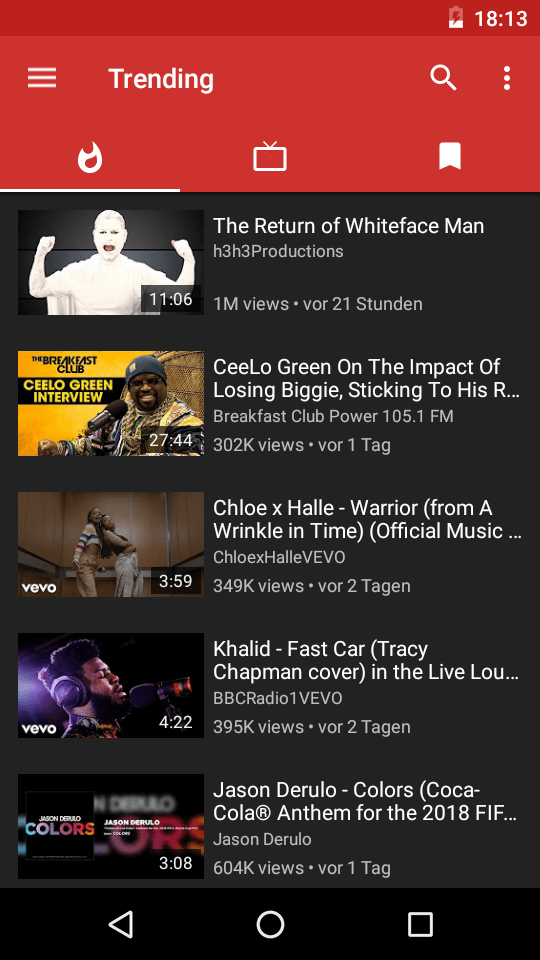
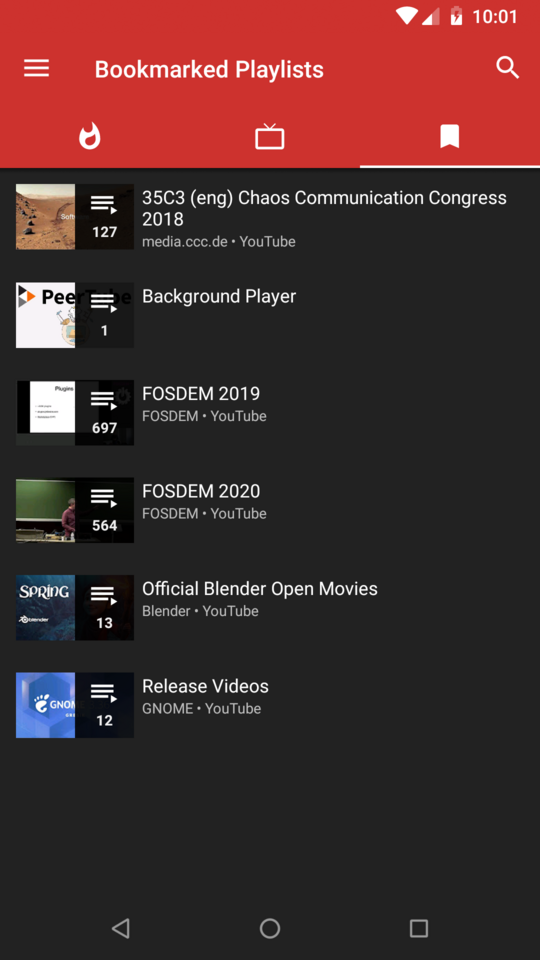
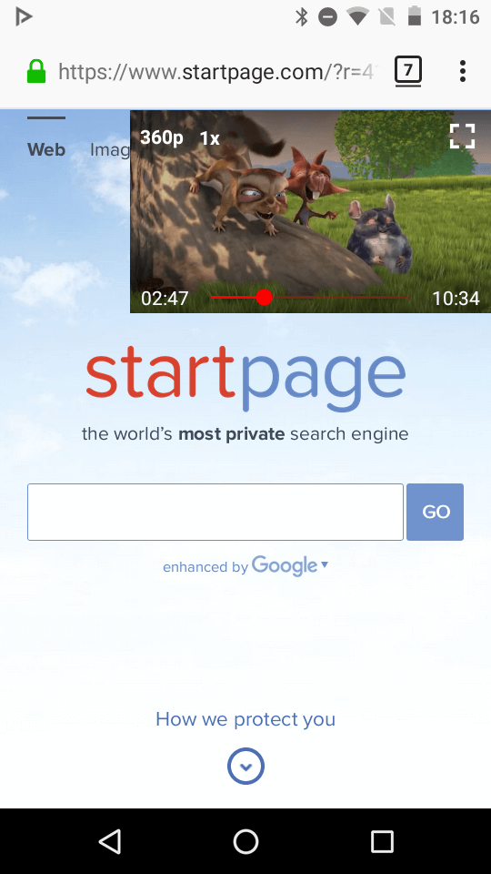
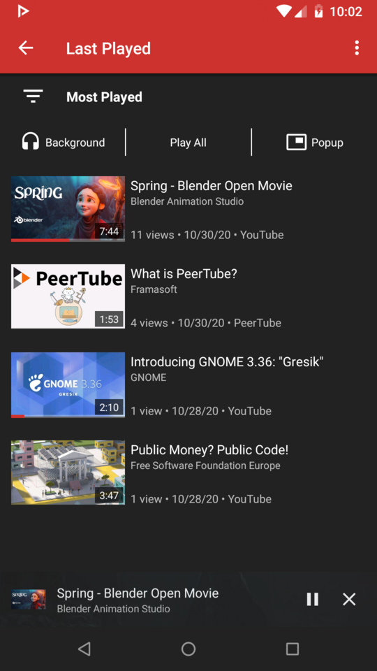
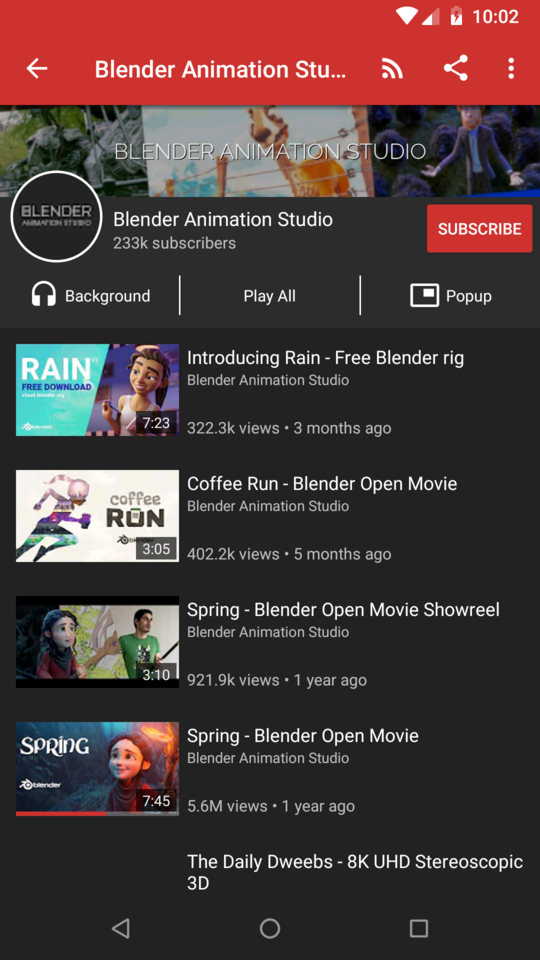
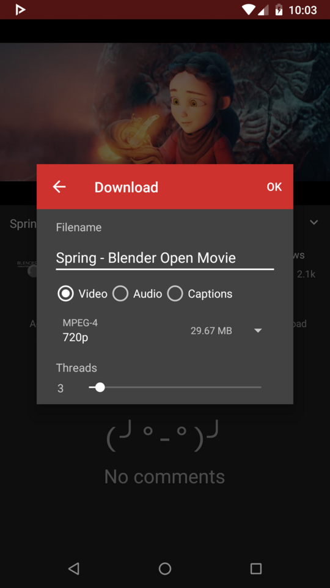
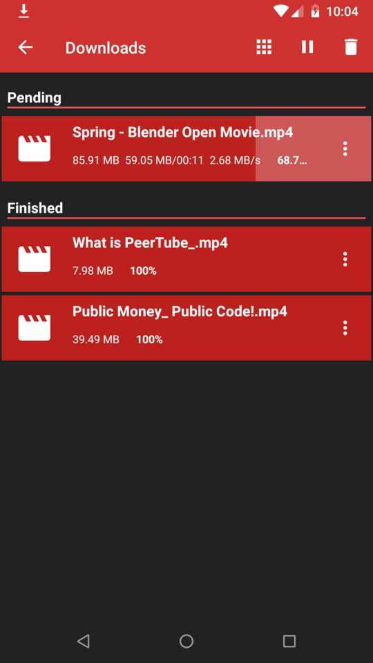
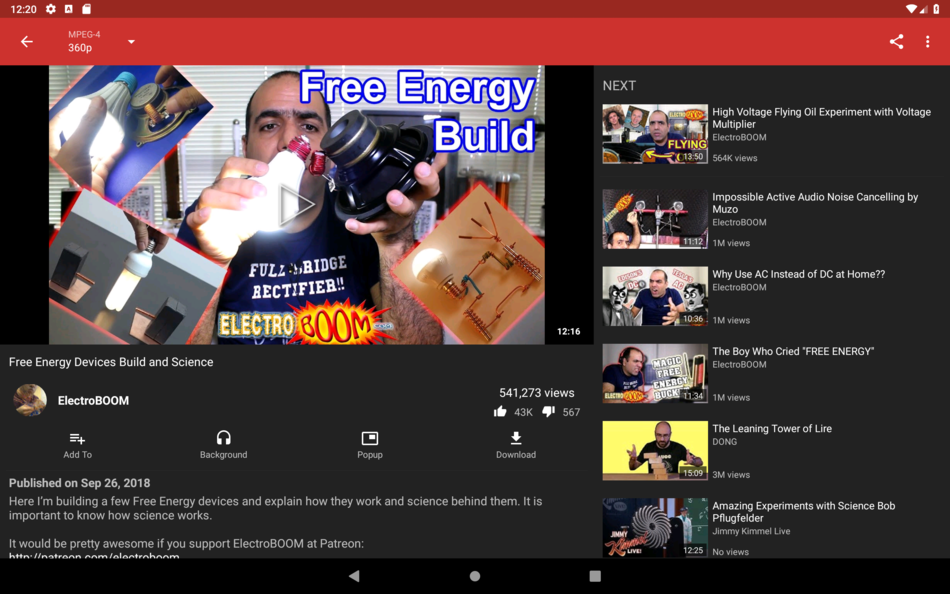

 
<h2 align="center"><b>New Tube</b></h2>
<h4 align="center">A libre lightweight streaming front-end for Android.</h4>

<a href="https://github.com/TeamNewPipe/NewPipe/releases">Download Apk</a> 

## Screenshots

### Supported Services

NewPipe currently supports these services:

<!-- We link to the service websites separately to avoid people accidentally opening a website they didn't want to. -->
* YouTube ([website](https://www.youtube.com/)) and YouTube Music ([website](https://music.youtube.com/)) ([wiki](https://en.wikipedia.org/wiki/YouTube))
* PeerTube ([website](https://joinpeertube.org/)) and all its instances (open the website to know what that means!) ([wiki](https://en.wikipedia.org/wiki/PeerTube))
* Bandcamp ([website](https://bandcamp.com/)) ([wiki](https://en.wikipedia.org/wiki/Bandcamp))
* SoundCloud ([website](https://soundcloud.com/)) ([wiki](https://en.wikipedia.org/wiki/SoundCloud))
* media.ccc.de ([website](https://media.ccc.de/)) ([wiki](https://en.wikipedia.org/wiki/Chaos_Computer_Club))

As you can see, NewTube supports multiple video and audio services. Though it started off with YouTube, other people have added more services over the years, making NewTube more and more versatile!

## Description

NewPipe works by fetching the required data from the official API (e.g. PeerTube) of the service you're using. If the official API is restricted (e.g. YouTube) for our purposes, or is proprietary, the app parses the website or uses an internal API instead. This means that you don't need an account on any service to use NewPipe.

Also, since they are free and open source software, neither the app nor the Extractor use any proprietary libraries or frameworks, such as Google Play Services. This means you can use NewPipe on devices or custom ROMs that do not have Google apps installed.

### Features

* Watch videos at resolutions up to 4K
* Listen to audio in the background, only loading the audio stream to save data
* Popup mode (floating player, aka Picture-in-Picture)
* Watch live streams
* Show/hide subtitles/closed captions
* Search videos and audios (on YouTube, you can specify the content language as well)
* Enqueue videos (and optionally save them as local playlists)
* Show/hide general information about videos (such as description and tags)
* Show/hide next/related videos
* Show/hide comments
* Search videos, audios, channels, playlists and albums
* Browse videos and audios within a channel
* Subscribe to channels (yes, without logging into any account!)
* Get notifications about new videos from channels you're subscribed to
* Create and edit channel groups (for easier browsing and management)
* Browse video feeds generated from your channel groups
* View and search your watch history
* Search and watch playlists (these are remote playlists, which means they're fetched from the service you're browsing)
* Create and edit local playlists (these are created and saved within the app, and have nothing to do with any service)
* Download videos/audios/subtitles (closed captions)
* Open in Kodi
* Watch/Block age-restricted material

## Privacy Policy

The NewPipe project aims to provide a private, anonymous experience for using web-based media services. Therefore, the app does not collect any data without your consent. NewPipe's privacy policy explains in detail what data is sent and stored when you send a crash report, or leave a comment in our blog. You can find the document [here](https://newpipe.net/legal/privacy/).

## License
  

NewPipe is Free Software: You can use, study, share, and improve it at will. Specifically you can redistribute and/or modify it under the terms of the [GNU General Public License](https://www.gnu.org/licenses/gpl.html) as published by the Free Software Foundation, either version 3 of the License, or (at your option) any later version.
